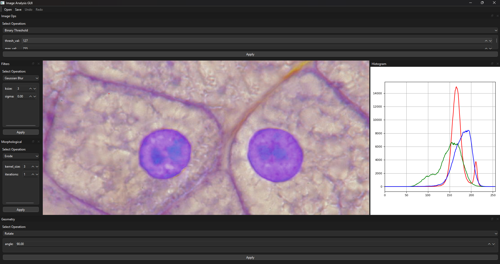

# imanalysisgui

**Advanced Image Analysis GUI**

This is an advanced ImageJ‑style GUI built with PyQt6 and OpenCV for common image analysis tasks. The project is modular with processing functions (filters, geometry, image operations, morphological operations, etc.) stored in the `src` folder. The GUI displays a central image canvas, a histogram, and multiple docks for different categories of image processing operations.

## Features

- **Central Canvas:** Load and display images.
- **Dynamic Docks:** Separate docks for:
  - **Filters:** Gaussian Blur, Median Filter, Canny Edge, etc.
  - **Geometry:** Rotate, Flip, Resize, Crop.
  - **Image Ops:** Thresholding, Histogram Equalization, CLAHE.
  - **Morphological Operations:** Erode, Dilate, Open, Close, etc.
- **Dynamic Parameters:** UI controls update based on the selected operation.
- **Asynchronous Processing:** Uses a thread pool (QRunnable) to prevent GUI freezing.
- **Undo/Redo History:** Step backwards and forwards through applied operations.
- **Histogram Display:** View image histograms for RGB channels.

## Screenshot

Below is a screenshot of the GUI. Place your screenshot image (e.g., `screenshot.png`) in the `docs` folder.



## Project Structure

imanalysisgui/ ├── docs/ │ └── screenshot.png # Screenshot of the GUI ├── gui.py # Main GUI application ├── src/ │ ├── init.py # Package initializer │ ├── image_ops.py # Basic image operations (read, write, split, etc.) │ ├── filters.py # Filtering functions (Gaussian, Median, etc.) │ ├── geometry.py # Geometric transformations (rotate, flip, resize, crop) │ ├── morphological.py # Morphological operations (erode, dilate, etc.) │ └── utils.py # Utility functions and FILTERS_MAP ├── .gitignore # Git ignore file ├── README.md # This file └── requirements.txt # Dependencies list

bash
Copy

## Installation

1. **Clone the repository:**

   ```bash
   git clone https://github.com/<your-username>/imanalysisgui.git
   cd imanalysisgui
Create a virtual environment (optional but recommended):

bash
Copy
python -m venv venv
# On Windows:
venv\Scripts\activate
# On macOS/Linux:
source venv/bin/activate
Install dependencies:

bash
Copy
pip install -r requirements.txt
Run the GUI:

bash
Copy
python gui.py
Contributing
Feel free to fork the repository and submit pull requests. If you add new image processing functions, update the FILTERS_MAP in src/utils.py so they appear in the GUI.

License
This project is licensed under the MIT License. See the LICENSE file for details.